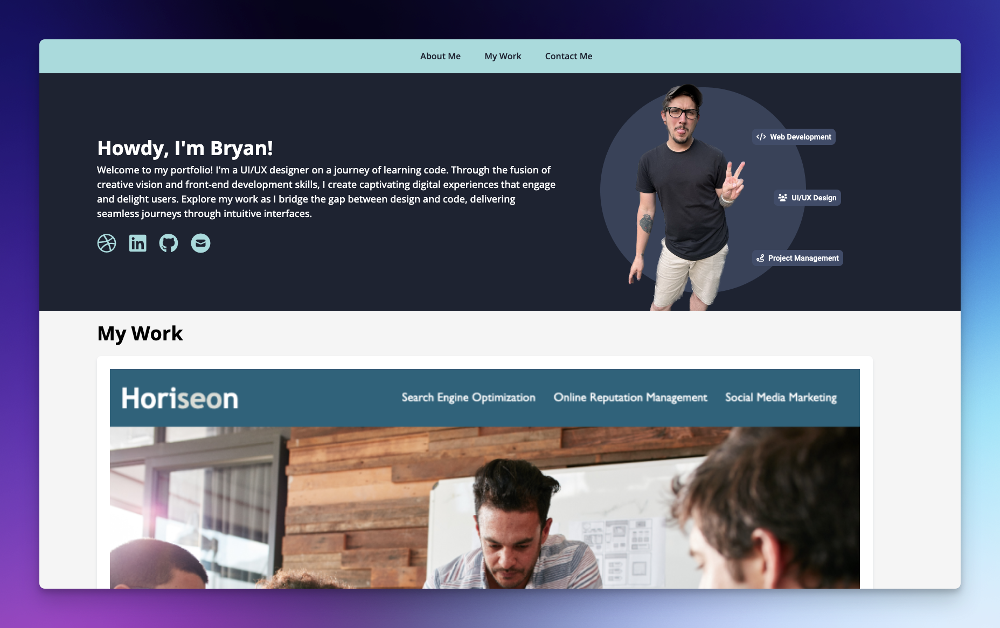

# My Portfolio
## User Story
`AS AN` employer  
`I WANT` to view a potential employee's deployed portfolio of work samples  
`SO THAT` I can review samples of their work and assess whether they're a good candidate for an open position  

## Acceptance Criteria 
`GIVEN` I need to sample a potential employee's previous work   
`WHEN` I load their portfolio   
`THEN` I am presented with the developer's name, a recent photo or avatar, and links to sections about them, their work, and how to contact them   
`WHEN` I click one of the links in the navigation   
`THEN` the UI scrolls to the corresponding section   
`WHEN` I click on the link to the section about their work  
`THEN` the UI scrolls to a section with titled images of the developer's applications  
`WHEN` I am presented with the developer's first application  
`THEN` that application's image should be larger in size than the others  
`WHEN` I click on the images of the applications  
`THEN` I am taken to that deployed application  
`WHEN` I resize the page or view the site on various screens and devices  
`THEN` I am presented with a responsive layout that adapts to my viewport  

## Overview
My portfolio page serves as a showcase of my skills and talents to potential employers. It highlights my strongest work and provides insights into the thought processes behind each project. I believe that having several deployed projects is crucial for success in the job search, and this portfolio page sets me up for future opportunities.

### Technologies Used
* HTML
* CSS Flexbox
* CSS Media queries
* CSS variables

### Deployment
I have deployed my portfolio page on the web to make it live and accessible. You can view my portfolio page by following this link: [Portfolio Page](https://briimcfly.github.io/bbickel-portfolio/)

### Features
* Responsive layout using flexbox and media queries.
* Consistent styling through the use of CSS variables.
* Interactive elements to enhance user experience.

### Reflection
This project has allowed me to apply the core skills I have recently learned and put them into practice. I enjoyed planning the page structure and implementing the design using HTML and CSS. The use of flexbox, media queries, and CSS variables enabled me to create a responsive and visually appealing layout.

### Future Enhancements
While I am satisfied with my portfolio page, there are a few areas I would like to enhance in the future:

* Incorporate additional projects as I complete them to further demonstrate my skills.
* Add a contact form to allow potential employers to reach out to me easily.
* Improve the responsive layout. 
